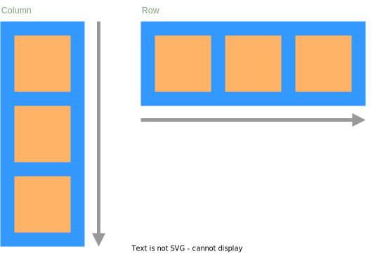

# Morphorm

Morphorm is a crate for efficiently determining the size and position of UI elements which are organized into a tree structure.

## Description

Morphorm is a 'one-pass' algorithm which recurses down the layout tree (depth-first), and determines the position and size of nodes based on their parent and children. It can produce similar layouts to flexbox, but with fewer concepts that need to be learned.

### Layout Type
The layout type property determines how children of a node will be arranged. There are two variants:
- `LayoutType::Row` - The node will arrange its children into a horizontal row.
- `LayoutType::Column` - The node will arrange its children into a vertical column.



### Size
The size of a node is determined by its `width` and `height` properties. These properties are specified with `Units`, which has four variants:
- `Units::Pixels(val)` - Sets the size to a fixed number of pixels.


- `Units::Percentage(val)` - Sets the size to a percentage of the nodes parent size.


- `Units::Stretch(factor)` - Sets the size to a proportion of the free space of the parent within the same axis.


- `Units::Auto` - Sets the size to either hug the nodes children, or to inherit the [content size](#content-size) of the node.


### Content Size
Content size is used to determine the size of a node which has no children but may have an intrinsic size due to contents which do not correspond to nodes in the layout tree. For example, a node which contains text has an intrinsic size of the bounds of the text, which may introduce a dependency between the width and height (i.e. when text wraps). Similarly, content size can be used to size a node with a particular aspect ratio by constraining the height to be some proportion of the width (or conversely).


### Space
The position of a node within a stack can be adjusted by the spacing applied to each of its four sides:
- `left` - The space that should be applied to the left side of the node. This takes precedent over `right` spacing.
- `right` - The space that should be applied to the right side of the node.
- `top` - The space that should be applied to the top side of (above) the node. This takes precedent over `bottom` space.
- `bottom` - The space that should be applied to the bottom side of (below) the node.


Spacing is specified with `Units`, which has four variants:
- `Units::Pixels(val)` - Sets the spacing to a fixed number of pixels.


- `Units::Percentage(val)` - Sets the spacing to a percentage of the nodes parent size.


- `Units::Stretch(factor)` - Sets the spacing to a proportion of the free space of the parent within the same axis.


- `Units::Auto` - Sets the spacing to inherit the [child spacing](#child-space) of the parent.


### Position Type
The position type property determines whether a node should be positioned in-line with its siblings in a stack, or out-of-line and independently of its siblings. There are two variants:
- `PositionType::ParentDirected` - The node will be positioned relative to its in-line position with its siblings.
- `PositionType::SelfDirected` - The node will be positioned out-of-line and relative to the top-left corner of its parent.


Self directed nodes do not contribute to the size of the parent when the parent size is set to auto.

### Child Space
The child space of a node applies space around its children by overriding the individual auto spacing of the nodes children and is also specified with `Units`.
- `child_left` - The space that should be applied between the left side of the view and its children with individual `Auto` left spacing. Applies to all children in a vertical stack and to the first child in a horizontal stack.


- `child_right` - The space that should be applied between the right side of the view and its children with individual `Auto` right spacing. Applies to all children in a vertical stack and to the first child in a horizontal stack.


- `child_top` - The space that should be applied between the top side of the view and its children with individual `Auto` top spacing. Applies to all children in a horizontal stack and to the first child in a vertical stack.


- `child_bottom` - The space that should be applied between the bottom side of the view and its children with individual `Auto` bottom spacing. Applies to all children in a horizontal stack and to the first child in a vertical stack.


There are two additional child-spacing properties for setting the space between child nodes:
- `row-between` - The space that should be applied between the children within a `Column` layout. Works by overriding the individual `top` and `bottom` spacing of the children if they are set to `Auto`.
- `col-between` - The space that should be applied between the children within a `Row` layout. Works by overriding the individual `left` and `right` spacing of the children if they are set to `Auto`.


### Constraints
All spacing and size properties can be constrained with corresponding minimum and maximum properties, which are also specified using `Units`. For example, the `width` of a node can be constrained with the `min_width` and `max_width` properties.


Specifying a minimum size of `Auto` will cause the node to be at least as large as its contents.


## How to use

To try and keep things as generic as possible Morphorm does not provide any containers for representing the layout properties or the tree.
Instead, two traits must be implemented by the users' containers in order to utilize the layout algorithm:

 - `Node` represents a UI element which can be sized and positioned. The node itself could contain the desired layout properties, or the properties can be provided by an external source (such as an ECS component store), which is provided by the `Store` associated type. The node must also provide an iterator over its children, specified by the `ChildIter` associated type, and to allow the children to be stored externally as well, there is a `Tree` associated type. Additionally, there is a `SubLayout` associated type which can be used to provide an external context when the size of a childless node is determined by its content, for example it may be used to provide a context for computing and caching the bounds of text within a node.
 - `Cache` represents a store for the output of the layout computation. The store is indexed by a reference to the node type, however, to allow store types which cannot use the node reference as a key, the `Node` trait also provides a `CacheKey` associated type.

### Example (ECS)

In the following example, nodes are represented by an ID type, which is used as a key for slotmaps which store the properties of a layout node.

#### Creating an ID type

First we define an `Entity` type to act as the ID:
```rs
#[derive(Debug, Clone, Copy, PartialEq, Eq, Hash, PartialOrd, Ord)]
pub struct Entity(pub usize);
```

We then create a simple entity manager which generates new entities. For this simple example the entity ID is generated from a counter, but a real system may need to handle the removal of entities.

```rs
pub struct EntityManager {
    count: usize,
}

impl EntityManager {
    pub fn create(&mut self) -> Entity {
        self.count += 1;
        Entity(self.count - 1)
    }
}
```

Next we'll implement the `Key` trait and the `From<KeyData>` trait so that the entity can be used as a key for a `SecondaryMap` from the `slotmap` crate:

```rs
unsafe impl Key for Entity {
    fn data(&self) -> slotmap::KeyData {
        KeyData::from_ffi(self.0 as u64)
    }

    fn null() -> Self {
        Entity::default()
    }

    fn is_null(&self) -> bool {
        self.0 == usize::MAX
    }
}

impl From<KeyData> for Entity {
    fn from(value: KeyData) -> Self {
        Entity(value.as_ffi() as usize)
    }
}
```

#### Defining the `Tree`

One way to represent the layout tree using an ID type is to store the parent, first-child, and next/prev -sibling IDs for each entity:

```rs
pub struct Tree {
    pub parent: Vec<Option<Entity>>,
    pub first_child: Vec<Option<Entity>>,
    pub next_sibling: Vec<Option<Entity>>,
    pub prev_sibling: Vec<Option<Entity>>,
}
```

See `ecs/tree.rs` for full implementation.

An iterator over the children of a node can then be constructed:

```rs
/// An iterator for iterating the children of an entity.
pub struct ChildIterator<'a> {
    pub tree: &'a Tree,
    pub current_node: Option<&'a Entity>,
}

impl<'a> Iterator for ChildIterator<'a> {
    type Item = &'a Entity;
    fn next(&mut self) -> Option<Self::Item> {
        if let Some(entity) = self.current_node {
            self.current_node = self.tree.get_next_sibling(entity);
            return Some(entity);
        }

        None
    }
}
```

#### Defining the `Store`

Let's now create a store type which, as the name suggests, will store the properties of a node:

```rs
pub struct PropertyStore {
    pub visible: SecondaryMap<Entity, bool>,

    pub layout_type: SecondaryMap<Entity, LayoutType>,
    pub position_type: SecondaryMap<Entity, PositionType>,

    pub left: SecondaryMap<Entity, Units>,
    pub right: SecondaryMap<Entity, Units>,
    pub top: SecondaryMap<Entity, Units>,
    pub bottom: SecondaryMap<Entity, Units>,

    ...

}
```

See `ecs/store.rs` for full implementation.

#### Defining the `Cache`

Next, we'll need a cache to store the output of the layout computation, also keyed by the entity ID:

```rs
pub struct NodeCache {
    // Computed size and position of nodes.
    pub rect: SecondaryMap<Entity, Rect>,
}
```

Then we'll implement the `Cache` trait on it:

```rs
impl Cache for NodeCache {
    type Node = Entity;

    fn set_bounds(&mut self, node: &Self::Node, posx: f32, posy: f32, width: f32, height: f32) {
        if let Some(rect) = self.rect.get_mut(*node) {
            rect.posx = posx;
            rect.posy = posy;
            rect.width = width;
            rect.height = height;
        }
    }

    fn width(&self, node: &Self::Node) -> f32 {
        if let Some(rect) = self.rect.get(*node) {
            return rect.width;
        }

        0.0
    }

    ...
}
```

#### Implementing the `Node` trait

We can now implement the `Node` trait for `Entity` type, filling in the associated types:

```rs
impl Node for Entity {
    type Store = Store;
    type Tree = Tree;
    type ChildIter<'t> = ChildIterator<'t>;
    type CacheKey = Entity;
    type SubLayout<'a> = ();

    fn key(&self) -> Self::CacheKey {
        *self
    }

    fn children<'t>(&self, tree: &'t Tree) -> Self::ChildIter<'t> {
        let current_node = tree.get_first_child(self);
        ChildIterator { tree, current_node }
    }

    fn visible(&self, store: &Store) -> bool {
        store.visible.get(*self).copied().unwrap_or(true)
    }

    fn layout_type(&self, store: &Store) -> Option<LayoutType> {
        store.layout_type.get(*self).copied()
    }
}
```
 
Because the node is just an ID, we can use itself for the `CacheKey`. For this example we've left the `Sublayout` type as empty, but a real system might use this for a text context. Each 'getter' function, such as `layout_type()`, retrieves its returned value from the `Store`.

#### Performing layout

Finally, layout can be performed on the whole tree via the root node:
```rs
root.layout(&mut cache, &tree, &store, &mut sublayout);
```

Not shown here is the construction of the tree prior to calling `layout`. See `ecs/world.rs` and `examples/basic.rs` for implementation details.